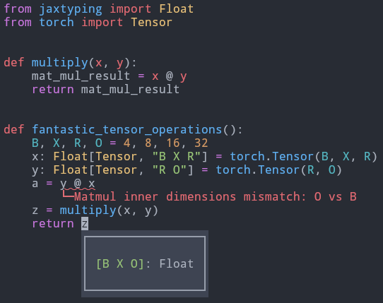

# shapels

**shapels** provides _shape inference_ for torch tensors inside your editor.



_But what does that mean?_ In the example above, **shapels** tracks the tensor dimensions
and is able to report the wrong matrix multiplication that would have caused a runtime error.

Not only that: when hovering over a tensor, it reports the shape of that tensor
through static analysis, even if no annotation was provided. It's effectively
replacing

```python
print(f"x -> {x.shape}")
```

but before running any code, in your editor of choice.

## Installation

If you are not using VSCode or Zed, go to [the latest release
page](https://github.com/carrascomj/shapels/releases/latest), download the
binary for your platform, unzip it and put it in your path.

**shapels**'s VScode extension comes with the binaries prebundled so this
step is not needed.

### Installing from source

The first step is to [install Rust](https://www.rust-lang.org/tools/install):

```bash
# Unix-like OS
curl --proto '=https' --tlsv1.2 -sSf https://sh.rustup.rs | sh
```

After cloning this repository, it can be installed with [cargo](https://doc.rust-lang.org/stable/cargo/guide/cargo-home.html):

```bash
git clone https://github.com/carrascomj/shapels.git
cd shapels
cargo install --path .
```

## Editor support

* [VSCode](https://code.visualstudio.com/download)

Just install it from the extensions marketplace, it comes with the `shapels` binary
prebundled for your platform.

But why don't you try Zed?

* [Zed](https://zed.dev)

Install it from the extensions tab. The extension will try to use the **shapels**
binary present in the `$PATH` (configurable) and, if not found, download it.

But why don't you try neovim?

* [neovim](https://neovim.io/)

Add it to your config (you must have **shapels** in you path):

```lua
vim.lsp.config('shapels', {cmd={'shapels'}, root_markers={'pyproject.toml', 'setup.py', 'setup.cfg'}, filetypes={'python'}})
vim.lsp.enable('shapels')
```

But why don't you try helix?

* [helix](https://helix-editor.com/)

Add it to your `languages.toml` (you must have **shapels** in you path):

```toml
[language-server]
shapels = {command = "shapels"}

[[language]]
name = "python"
scope = "source.python"
injection-regex = "py(thon)?"
file-types = ["py", "pyi", "py3", "pyw", "ptl", "rpy", "cpy", "ipy", "pyt", { glob = ".python_history" }, { glob = ".pythonstartup" }, { glob = ".pythonrc" }, { glob = "*SConstruct" }, { glob = "*SConscript" }, { glob = "*sconstruct" }]
shebangs = ["python", "uv"]
roots = ["pyproject.toml", "setup.py", "poetry.lock", "pyrightconfig.json"]
comment-token = "#"
# WARN: probably you have other LS already here, just add shapels to the list
language-servers = ["shapels"]
indent = { tab-width = 4, unit = "    " }  
```

But why don't you try Emacs?

* [Emacs](https://www.gnu.org/software/emacs/)

It's a language server: it takes input from stdin and sends output to stdout; you probably
know how to handle that.

## License

Licensed under either of

- Apache License, Version 2.0, ([LICENSE-APACHE](LICENSE-APACHE) or http://www.apache.org/licenses/LICENSE-2.0)
- MIT license ([LICENSE-MIT](LICENSE-MIT) or http://opensource.org/licenses/MIT)

at your option.

### Contribution

Unless you explicitly state otherwise, any contribution intentionally submitted
for inclusion in the work by you, as defined in the Apache-2.0 license, shall be dual licensed as above, without any
additional terms or conditions.

